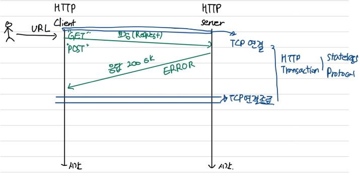
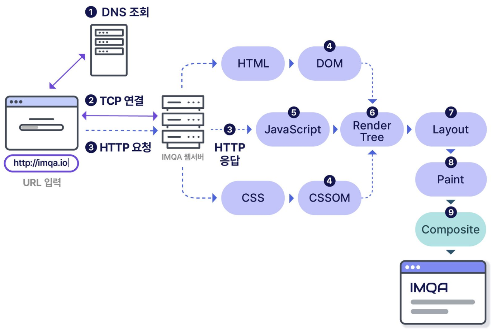

# Rest API란 무엇인가?

## 사전 학습
### 1. HTTP 통신에 관하여
**HTTP(Hypertext Transfer Protocol)**는 텍스트 기반의 통신 규약으로 인터넷에서 데이터를 주고받을 수 있는 프로토콜입니다. 월드 와이드 웹의 토대이며 하이퍼텍스트 링크를 사용하여 **웹 페이지를 로드**하는 데 사용됩니다.

#### 기본 동작
- Web 자료를 가져와서 (GET) 보여주기
- Web에 자료를 Posting 하기


#### HTTP 요청에는 어떤 것들이 들어 있을까?
일반적인 HTTP 요청에는 다음이 포함됩니다.
1. HTTP 버전 유형
2. URL
3. HTTP 메서드
4. HTTP 요청 헤더
5. 선택 사항인 HTTP 본문


#### 웹 브라우저 동작 방식
- 출처 : https://velog.io/@3436rngus/%EC%9B%B9-%EB%B8%8C%EB%9D%BC%EC%9A%B0%EC%A0%80-%EB%8F%99%EC%9E%91-%EC%9B%90%EB%A6%AC


### 2. API란?
API(애플리케이션 프로그래밍 인터페이스)는 애플리케이션이나 디바이스가 서로 간에 연결하여 통신할 수 있는 방법을 정의하는 규칙 세트입니다.

즉, 웹 API는 클라이언트와 웹 리소스 사이의 게이트웨이라고 생각할 수 있습니다.

**클라이언트**
클라이언트는 웹의 정보에 엑세스하려는 사람, API 사용자 혹은 시스템입니다.

**리소스**
리소스는 클라이언트에게 제공하는 정보이며, 클라이언트에 다양한 리소스를 제공하는 시스템을 서버라고 합니다.

---

## Rest API
 **REST API**는 REST(REpresentational State Transfer) 아키텍처 스타일의 디자인 원칙을 준수하는 API입니다. 이러한 이유로 REST API를 **RESTful API**라고도 합니다.

- URI를 통해 자원을 명시하고, HTTP Method(Post, Get, PUT, Delete)를 통해 해당자원의 CRUD를 적용한다.
```
CRUD 
Create : 생성(POST)
READ : 조회(GET)
Update : 수정(PUT)
Delete : 삭제(Delete)
HEAD : header 정보 조회(HEAD)
```


### 장단점
**장점**
- HTTP를 활용하여, 별도 인프라 구축 필요 없다
- HTTP 표준 프로토콜에 따르는 모든 플랫폼에서 사용 가능
- Rest API에 메시지가 의도하는 바를 명확하게 나타낼 수 있다.
- 여러가지 서비스 디자인에서 생길 수 있는 문제를 최소화 한다.
- 서버와 클라이언트의 역할을 명확하게 분리한다.

**단점**
- 표준이 존재하지 않는다.
- 사용할 수 있는 메소드가 제한적이다.
- 구형 브라우저가 아직 제대로 지원하지 못한다 ( PUT, DELETE, pushState )


### 그럼에도 필요한 이유
1. 애플리케이션 분리 및 통합
2. 다양한 클라이언트의 등장 
3. 서버의 다양화, 다양한 브라우저


### 동작 과정
1. 클라이언트가 서버에 요청을 전송합니다. 클라이언트가 API 문서에 따라 서버가 이해하는 방식으로 요청 형식을 지정합니다.
2. 서버가 클라이언트를 인증하고 해당 요청을 수행할 수 있는 권한이 클라이언트에 있는지 확인합니다.
3. 서버가 요청을 수신하고 내부적으로 처리합니다.
4. 서버가 클라이언트에 응답을 반환합니다. 응답에는 요청이 성공했는지 여부를 클라이언트에 알려주는 정보가 포함됩니다. 응답에는 클라이언트가 요청한 모든 정보도 포함됩니다.

---

# API 가이드 문서 키워드 학습
### pathVariable
- 경로 변수를 표시하기 위해 `메서드의 매개변수`에 사용된다.
- 경로 변수는 `중괄호 {id}`로 둘러싸인 값
- URL 경로에서 변수 값을 추출하여 매개변수에 할당
- 기본적으로 경로 변수는 반드시 값을 가져야 하며, 없으면 404 ERR 발생
- 주로 상세 조회, 수정, 삭제와 같은 작업에서 리소스 식별자로 활용


### JSON
- avaScript Object Notation라는 의미의 축약어로 데이터를 저장하거나 전송할 때 많이 사용되는 경량의 DATA 교환 형식
- JSON 표현식은 사람과 기계 모두 이해하기 쉬우며 용량이 작아서, 최근에는 - JSON이 XML을 대체해서 데이터 전송 등에 많이 사용한다.
- JSON은 데이터 포맷일 뿐이며 어떠한 통신 방법도, 프로그래밍 문법도 아닌 단순히 데이터를 표시하는 표현 방법일 뿐이다.


### 참고
- https://velog.io/@freemoon99/%EB%84%A4%ED%8A%B8%EC%9B%8C%ED%81%AC-%EC%9D%91%EC%9A%A9%EA%B3%84%EC%B8%B52-FTP-HTTP%EC%99%80-%EA%B0%99%EC%9D%80-%EA%B8%B0%EB%B3%B8-%EC%9D%91%EC%9A%A9-%EA%B3%84%EC%B8%B5-%ED%94%84%EB%A1%9C%ED%86%A0%EC%BD%9C
- https://www.cloudflare.com/ko-kr/learning/ddos/glossary/hypertext-transfer-protocol-http/
- https://velog.io/@3436rngus/%EC%9B%B9-%EB%B8%8C%EB%9D%BC%EC%9A%B0%EC%A0%80-%EB%8F%99%EC%9E%91-%EC%9B%90%EB%A6%AC
- https://www.ibm.com/kr-ko/topics/rest-apis
- https://aws.amazon.com/ko/what-is/restful-api/
- https://woogienote.tistory.com/104#:~:text=%F0%9F%94%8D%40PathVariable%20%EC%9D%B4%EB%9E%80%3F,%EB%A7%A4%EA%B0%9C%EB%B3%80%EC%88%98%EC%97%90%20%ED%95%A0%EB%8B%B9%ED%95%9C%EB%8B%A4.